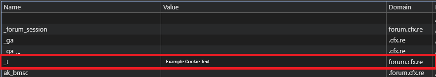

## Obtaining Your Cfx Connection Cookie

This guide will walk you through the process of locating and copying your Cfx forum authentication cookie, which is required for your bot to manage asset grants via your account.

> [!IMPORTANT]
> **Risk Warning**: This guide uses a method to automate access to the Cfx Portal via your connection cookie. This approach is not explicitly prohibited by Cfx, however, it has been stated in unofficial channels that people using external systems to communicate via software with the Cfx Portal can be subject to sanctions. Use this system at your own risk.

---

### Step 1: Access the Cfx Forums

1.  Go to the [cfx forums](https://forum.cfx.re) and **log in** with the account you use for granting assets.

---

### Step 2: Open Developer Tools

1.  Open your browser's **Developer Tools**.
    * *Generally via* `Ctrl + Shift + I` *(Windows/Linux) or* `Cmd + Option + I` *(macOS)*, *or by* `Right Click -> Inspect Element` *on the page.*

---

### Step 3: Locate the Cookies Tab

1.  Navigate to the **Cookies** storage.
    * **For Chromium-based browsers (Chrome, Edge, etc.):**
        1.  Click the **`Application`** tab (you may need to click the `>>` icon to find it).
        2.  Under the **Storage** section, select **`Cookies`** and then select the entry corresponding to the forum URL (e.g., `https://forum.cfx.re`).

---

### Step 4: Copy the Authentication Cookie

1.  Locate the cookie named **`_t`**.
2.  Copy the **entire contents** of the **Value** column for this cookie.

---

### Step 5: Place the Cookie in Configuration

1.  Paste the copied cookie value into the appropriate configuration setting within your **`.env`** file.

> [!WARN]
> **Security Warning:** Do not share this cookie! Sharing it is similar to sharing your username and password for your Cfx account. It is **your duty** to ensure the security of your credentials. Do not share them!
